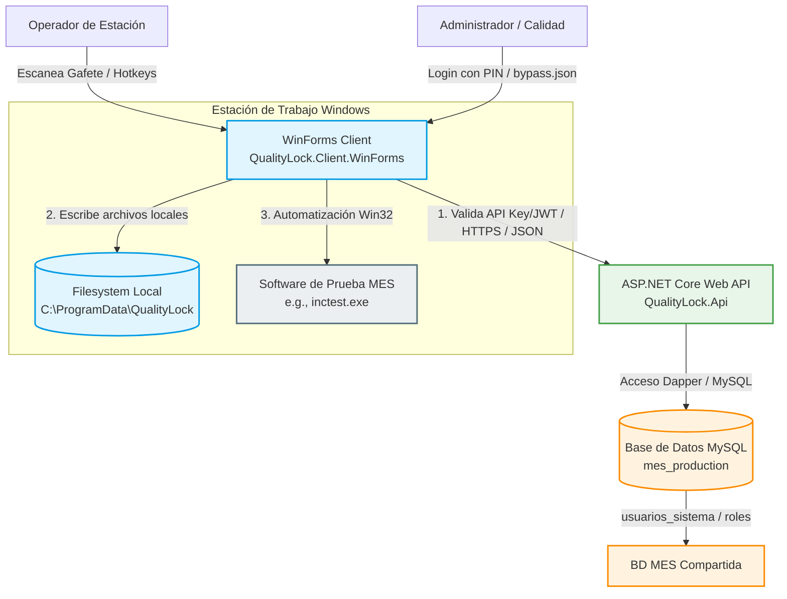
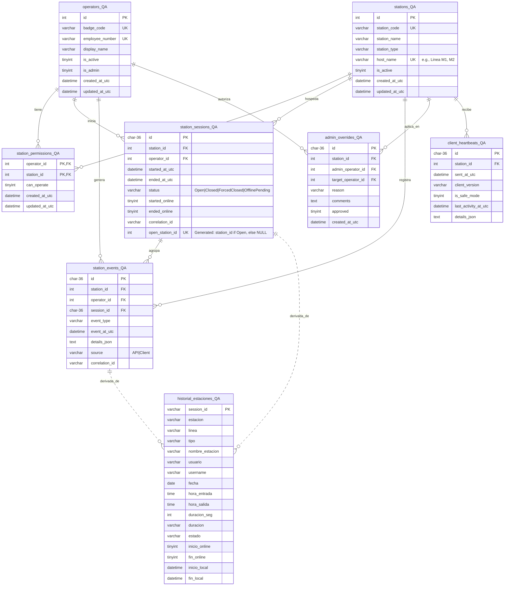
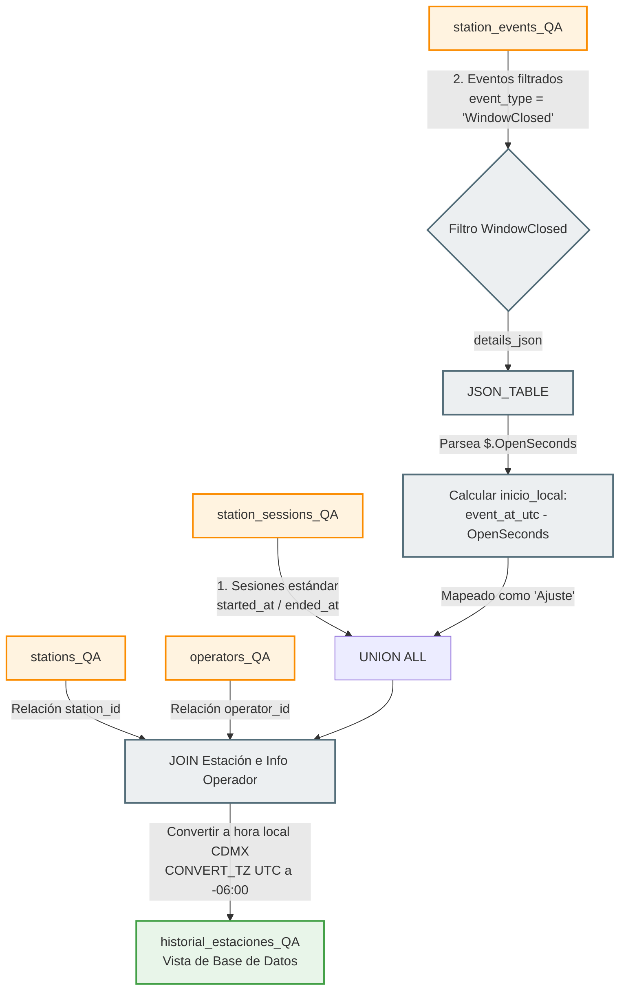
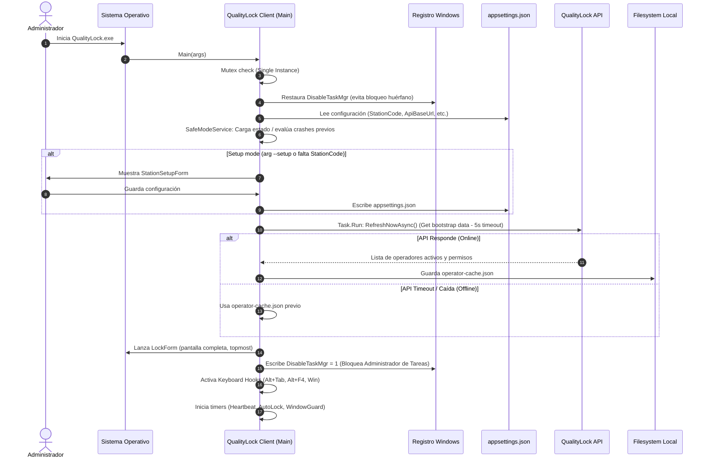
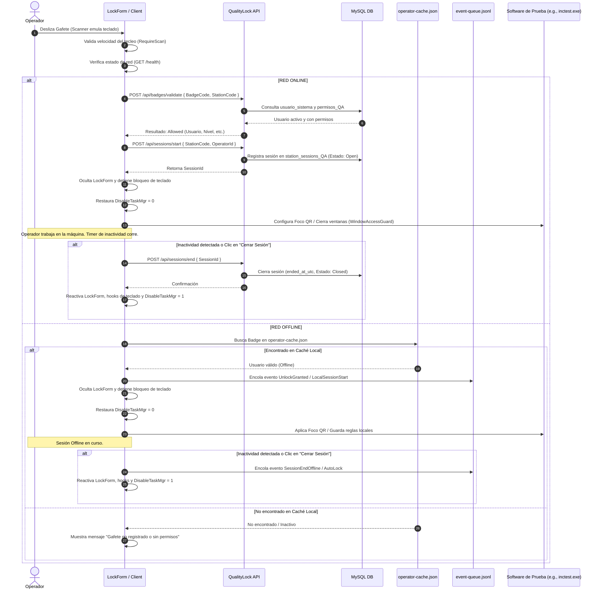
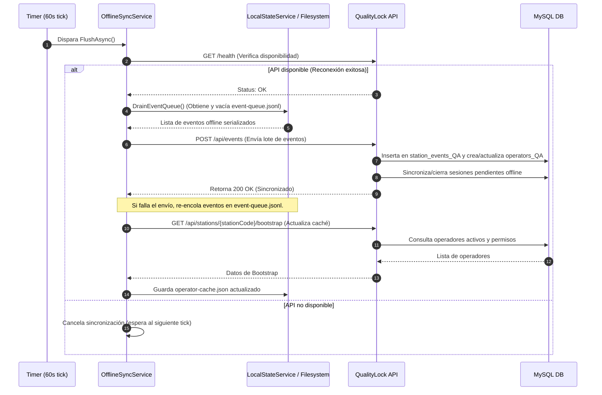
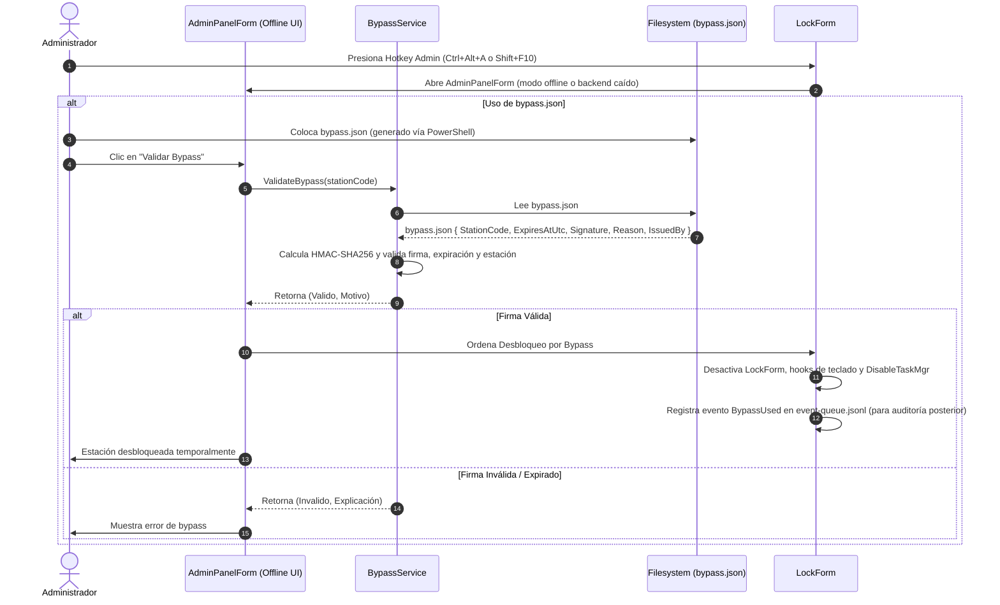
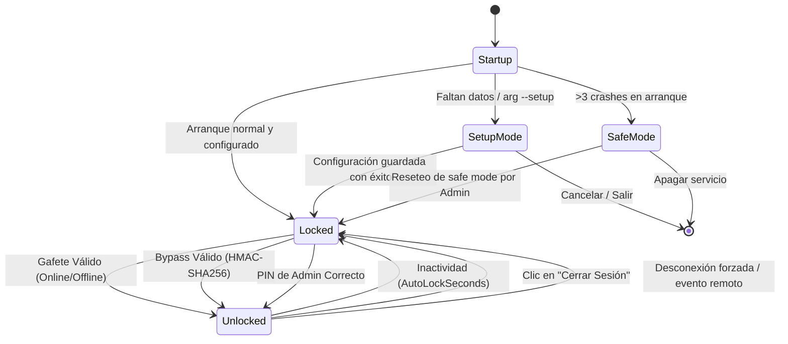

# QualityLock - Arquitectura y Operación

Este documento detalla el diseño de software, la base de datos, los flujos de datos en línea y fuera de línea, y los mecanismos de seguridad/recuperación del sistema **QualityLock**.

---

## 1. Estructura de Proyectos (Capas)

QualityLock está estructurado bajo principios de arquitectura en capas desacopladas, lo que permite separar la interfaz de usuario de las reglas de negocio y del acceso a datos.



| Capa | Carpeta / Link | Responsabilidad |
|---|---|---|
| **Shared** | [QualityLock.Shared](file:///c:/Users/yahir/OneDrive/Escritorio/MES/Bloqueo%20calidad/src/QualityLock.Shared) | Contiene DTOs, enums, constantes físicas, nombres de rutas y constantes compartidas. |
| **Domain** | [QualityLock.Domain](file:///c:/Users/yahir/OneDrive/Escritorio/MES/Bloqueo%20calidad/src/QualityLock.Domain) | Define las entidades puras del negocio: operadores, estaciones, sesiones de uso, auditoría, eventos. |
| **Application** | [QualityLock.Application](file:///c:/Users/yahir/OneDrive/Escritorio/MES/Bloqueo%20calidad/src/QualityLock.Application) | Casos de uso prácticos e interfaces (reglas de negocio de inicio/fin de sesión, validación de gafete). |
| **Infrastructure** | [QualityLock.Infrastructure](file:///c:/Users/yahir/OneDrive/Escritorio/MES/Bloqueo%20calidad/src/QualityLock.Infrastructure) | Implementaciones físicas de acceso a datos utilizando **MySQL 8** + **Dapper**. |
| **Api** | [QualityLock.Api](file:///c:/Users/yahir/OneDrive/Escritorio/MES/Bloqueo%20calidad/src/QualityLock.Api) | Backend HTTP REST construido en **ASP.NET Core 9**, seguridad JWT y Serilog. |
| **Client.WinForms** | [QualityLock.Client.WinForms](file:///c:/Users/yahir/OneDrive/Escritorio/MES/Bloqueo%20calidad/src/QualityLock.Client.WinForms) | Cliente gráfico de escritorio que actúa como pantalla de bloqueo agresivo, lectura de escáner y bypass local. |

---

## 2. Diagrama de Entidad-Relación (ERD) y Diseño de Base de Datos

Este diagrama representa la estructura de las tablas de base de datos MySQL (con el sufijo `_QA`) y la vista de historial calculada, además de sus relaciones y derivaciones.



> [!NOTE]
> La tabla `usuarios_sistema` es la fuente de verdad del MES (de solo lectura para QualityLock). Para mantener la integridad referencial de llaves foráneas (`FK`), la API crea o actualiza filas de forma idempotente en `operators_QA` vinculándolas mediante el `username` del MES.
>
> [003_unique_open_session.sql](file:///c:/Users/yahir/OneDrive/Escritorio/MES/Bloqueo%20calidad/database/mysql/003_unique_open_session.sql) introduce la columna autogenerada `open_station_id` con un índice único para garantizar que a nivel físico no existan múltiples sesiones abiertas concurrentes para la misma estación.
>
> La unicidad de la estación se define como `(station_code, host_name)` según [005_station_unique_code_line.sql](file:///c:/Users/yahir/OneDrive/Escritorio/MES/Bloqueo%20calidad/database/mysql/005_station_unique_code_line.sql), de modo que un mismo código de máquina puede convivir en diferentes líneas físicas.

### Vista de Historial Unificado (historial_estaciones_QA)

La vista [historial_estaciones_QA](file:///c:/Users/yahir/OneDrive/Escritorio/MES/Bloqueo%20calidad/database/mysql/004_historial_view.sql) unifica dos orígenes de datos en el sistema para proporcionar un reporte consolidado de tiempo de uso y tiempos de ajuste en piso de manufactura:
1. **Sesiones Ordinarias**: Registros en `station_sessions_QA` (inicios de sesión estándar online u offline).
2. **Sesiones de Ajuste**: Provenientes de eventos de tipo `WindowClosed` en `station_events_QA`. Estos se interpretan como periodos de "Ajuste" donde la estación estuvo temporalmente abierta o modificada y la duración se extrae dinámicamente de la columna JSON `details_json` (propiedad `OpenSeconds`).



* **Cálculo de Tiempos**: Para los registros de "Ajuste", la fecha y hora de entrada se calculan restando la duración del ajuste (`OpenSeconds`) al instante en que ocurrió el evento (`event_at_utc`), mientras que la hora de salida corresponde a `event_at_utc`.
* **Conversión de Zonas Horarias**: La vista utiliza `CONVERT_TZ` para transformar los valores de hora guardados en UTC a hora local de la planta (por defecto UTC-6, CDMX).

---

## 3. Flujo de Inicialización del Cliente WinForms

Al arrancar en Windows, el cliente realiza chequeos de salud previa, valida configuraciones básicas y determina si se requiere inicializar la interfaz de bloqueo completo.



- **Restauración Inicial**: Al arrancar, el cliente siempre borra cualquier rastro de `DisableTaskMgr` en el registro. Si la aplicación crasheó a mitad de sesión, esto asegura que el Administrador de tareas no quede permanentemente bloqueado.
- **Safe Mode**: Si el sistema detecta que el cliente se cae de manera iterativa al inicio (3 crashes consecutivos en menos de 5 min), no instala el hook de teclado agresivo ni modifica el registro, facilitando que el administrador del sistema cierre o repare el programa. Ver [SafeModeService.cs](file:///c:/Users/yahir/OneDrive/Escritorio/MES/Bloqueo%20calidad/src/QualityLock.Client.WinForms/Services/SafeModeService.cs).

---

## 4. Ciclo de Vida de Sesión (Validación Online vs. Cache Offline)

El escaneo del gafete es interceptado por un control de texto invisible en el formulario de bloqueo. Tras medir los intervalos del teclado (asegurando que es una entrada rápida simulada por un escáner y no entrada humana manual), se valida al operador.



---

## 5. Sincronización Offline y Flujo de Heartbeats

Cuando la conexión con la API falla, los eventos de desbloqueo, bloqueo automático y uso de bypass se escriben inmediatamente como líneas JSON independientes en `event-queue.jsonl`. Un servicio en segundo plano sincroniza estos eventos una vez detectada la red en línea.



- La lógica de lectura y purga atómica de eventos encolados se maneja en [OfflineSyncService.cs](file:///c:/Users/yahir/OneDrive/Escritorio/MES/Bloqueo calidad/src/QualityLock.Client.WinForms/Services/OfflineSyncService.cs).

---

## 6. Recuperación Local y Bypass de Contingencia

En situaciones extremas donde no hay conexión y un operador requiere desbloquear la estación, se puede colocar el archivo de firma local `bypass.json` en `C:\ProgramData\QualityLock\`. El cliente validará digitalmente el archivo antes de liberar el sistema.



- El script en [Generate-Bypass.ps1](file:///c:/Users/yahir/OneDrive/Escritorio/MES/Bloqueo%20calidad/tools/Generate-Bypass.ps1) genera firmas HMAC válidas usando la misma clave configurada en el cliente (`BypassHmacSecret`).

---

## 7. Máquina de Estados del Cliente

El estado de la aplicación gráfica del cliente transiciona en base al siguiente diagrama:



---

## 8. Automatización de Foco QR y Guardián de Ventanas

Cuando la estación está desbloqueada y el operador está trabajando, QualityLock automatiza y asegura la estación mediante llamadas de bajo nivel a la API de Windows (Win32 P/Invoke).

```mermaid
graph TD
    classDef action fill:#fff3e0,stroke:#fb8c00,stroke-width:2px;
    classDef dec fill:#f3e5f5,stroke:#8e24aa,stroke-width:2px;
    classDef start fill:#e8f5e9,stroke:#43a047,stroke-width:2px;

    Start([Estación Desbloqueada & Sesión Activa]):::start --> QR[QR Input Focus Service]
    
    subgraph QR Input Focus
        QR --> IsQR{¿Configurado?}:::dec
        IsQR -- Sí --> FindWin{¿Busca control Edit?}:::dec
        FindWin -- Encontrado --> FocusEdit[Usa Win32 SetFocus al control textbox]:::action
        FindWin -- No Encontrado --> RelativeClick[Usa coordenadas relativas y envía clic físico]:::action
        IsQR -- No --> NoAction[No realiza acción de foco]
    end

    Start --> GuardTimer[Window Guard Timer - Cada 1-2s]
    
    subgraph Window Access Guard
        GuardTimer --> EnumWindows[Enumera Ventanas y Procesos Abiertos]:::action
        EnumWindows --> MatchRule{¿Coincide con regla de ventana protegida?}:::dec
        MatchRule -- Sí --> CheckRole{¿Usuario actual tiene rol permitido?<br/>(e.g., Tecnico QA, superadmin)}:::dec
        CheckRole -- No --> ActionRule{Acción configurada}:::dec
        ActionRule -- Close --> CloseWindow[Cierra o destruye ventana externa]:::action
        ActionRule -- Overlay --> ShowOverlay[Muestra pantalla de overlay restrictiva]:::action
        CheckRole -- Sí --> AllowWindow[Permite que la ventana siga abierta]
        MatchRule -- No --> AllowWindow
    end
```

- **Focus QR**: El servicio [ExternalInputFocusService.cs](file:///c:/Users/yahir/OneDrive/Escritorio/MES/Bloqueo%20calidad/src/QualityLock.Client.WinForms/Services/ExternalInputFocusService.cs) maximiza la ventana de la aplicación de prueba, busca el control text-box objetivo para hacer foco, o realiza un clic relativo sobre las coordenadas configuradas por el usuario.
- **Window Access Guard**: El servicio [ExternalWindowGuardService.cs](file:///c:/Users/yahir/OneDrive/Escritorio/MES/Bloqueo%20calidad/src/QualityLock.Client.WinForms/Services/ExternalWindowGuardService.cs) monitorea constantemente el árbol de procesos de Windows y cierra o cubre con una advertencia roja (`WindowAuthorizationOverlay`) cualquier pantalla prohibida (como el visor de errores en bypass del software de pruebas).
